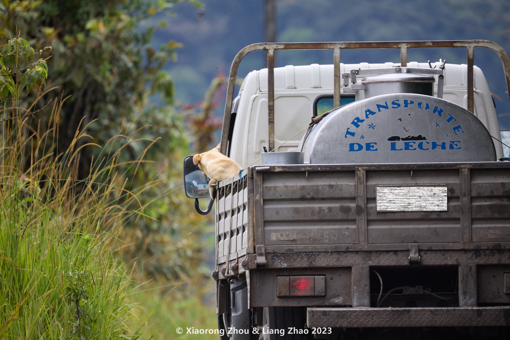

<!-- 南美初体验 二 观鸟江湖，人均藏龙卧虎 -->

我们的正式旅程开始于越野车。出了首都，离开了Uber和触手可及的城市化生活，我们渐渐接近我们此行的第一个目的地，Mindo云雾森林。热带雨林我们在东南亚曾经体验过，甚至我们还曾经互相怂恿自不量力在三十八度以上的雨林里爬过一上午的山，期间各种被蚊虫骚扰不提，汗出了一层又一层，最后整个人像从水里捞出来那么湿，全身每块肌肉都在颤抖。下山时我忍不住累到痛哭一场外加大吵一架，此后达成共识为了婚姻稳定这辈子不能再碰极限运动——气温三十度以上爬山就算极限。
但是这边的树林不叫雨林（rainforest），反而叫云林（cloud forest）。因为海拔略高，降水主要来自山间白云而非湿热水汽。行走其间，林中风景如画温度适宜，清风微抚，植物翠绿欲滴，简直要把东南亚诸国都叫过来观摩学习，同在赤道附近，你们也学学人家。

     
    

        <b>云林（cloud forest）</b>  摄于厄瓜多尔 Mindo
    
 

反正假期还长，反正房钱便宜到几乎不可思议，二十美元一晚就租下整个度假屋（另外两个房间刚好空着），露台宽敞，还有两个吊床，头几天倒时差睡不着，清晨三四点就醒了，天刚蒙蒙亮，跑到露台上听鸟儿们叽叽喳喳吃早饭，看着手机上app识别出新的小鸟邻居，等光线再好些时一边吃早饭一边看外面飞过的鸟们，每一只都没见过，每一只都好看，常常吃两口就抓起相机跑到露台边，从早上拍到半上午，简直没有比这更完美的假期。

     
    

        <b>度假屋露台</b>  摄于厄瓜多尔 Mindo
    
 

热情的民宿房东估计比我们年龄稍长，据说走遍了半个地球，经历了人生的大起大落，失业又失婚之后想起了家里还有那么个祖传的度假屋。于是回乡修房子打井摇身一变开了民宿，从此以遇见全球客人为人生要务。要说大哥也有天赋，生在日内瓦，母语西班牙语，兼会流利近母语英语法语意大利语，走遍欧洲都不怕，令我等耗费半生学才勉强把两门外语学到够用的人羡慕得眼红。
我们第一次去西班牙时完全是个文盲，全靠谷歌翻译和肢体语言交流。于是我回来痛下决心要学会西班牙语，但再澎湃的热情也抵挡不住惰性，坚持了那么几十个小时就当决心不存在，转眼现在又要去只说西班牙语的地区度假。临行前我们把晚餐的电子榨菜换成了西班牙语基础词汇300个临时抱佛脚，去之前练得最熟练的一句就是：
>yo aprendo espanol，yo hablo ingles，¿Hablas inglés?  （我在学西班牙语，我说英语，你说英语吗？）

就凭这个西班牙语水平我们这一路的旅行可太刺激了。心情随时都可以在迷茫和惊喜中来回切换。本来嘛，在南美这个著名观鸟圣地，手持藏都藏不住的长焦镜头，走在路上不怎么看人，目光随时追逐着树上鸟影跃动，谁都能一眼看出我们是来观鸟的游客。走在街上经常遇到各行各业的人向我们精确兜售各种观鸟导游路线。但，真的不要低估南美人民天生的好客与热情。我们在与当地人相处的过程中体会到的友善，纵然是商业化也掩盖不了，到后来简直有种武侠小说里的义薄云天之感。

就说民宿房东的固定合作伙伴司机大叔吧。大叔第一天开着一辆末日废土风格、目测车龄超过三十年的皮卡接我们从镇上回了民宿，路上还在顺路捎了几个放学的孩子。或许因为小镇上大家都是熟人，又或许是这边的父母不会教育小朋友不能上陌生人的车，反正小朋友们上下车时娴熟地和大叔打招呼的样子说明对他们而言这种事情根本不值得多虑。第二天我们徒步去了镇上，回来懒得走，求民宿房东远程叫个车，大叔乐颠颠来接我们，顺便还在下车的时候比划着跟我们聊附近有绿犀鸟，听，那个什么什么的叫声就是它叫的。没经验如我们当然没找到绿犀鸟，白白浪费司机大叔一片好心。第三天我们打算去一个山里的瀑布附近看鸟，路有点远，请民宿房东再帮我们找个出租车。早上一看，来得还是那辆熟悉的破皮卡和熟悉的司机大叔。大叔一听说我们没找到绿犀鸟，心里估计觉得我们错过了一个亿。于是几乎以义不容辞的态度一路开车一路帮我们找鸟。进山前的路还好，进了山之后，大叔几乎是看到一个观鸟团就主动打个招呼问看到了啥今天在哪能看到什么鸟。倒是我们坐在车里都有点不好意思，觉得蹭人家鸟导信息又不付钱。
忽然大叔熄了火，侧耳听了一下，冲我们打手势让我们下车：

>Guan！

Guan？冠雉？在我印象中是孔雀那么大的鸟，在附近肯定能看到，但我们前面是一片林子，附近也没听到类似鸡的鸣叫，在哪？
大叔看我们仍然迷茫，索性下车指给我们看，背后，大树，guan。嗯，这次其中一只鸟慌慌张张飞走了，倒是让我们看到了鸟的位置。但是隔着一片林子，800mm的长焦也够不着，我指指相机，摇摇头，用英语跟大叔说，太远啦，拍不到照片。
大叔好像听懂了，但并不认同。大叔根本没多废话，直接在前面开路，领着我们硬钻进了没有路的林子里，一边走还一边非常贴心地跟我们展示某种竹子一样植物叶子背后的尖刺，提醒我们不要被扎到。我们完全来不及反应，只好目瞪口呆地茫然跟着大叔往林子里走，心想这真是人生新体验。我们之前只知道世上本没有路，走的人多了也便成了路，今天学到了没有路也可以铁了头硬闯。
果然我们就穿过林子来到了树下，大如孔雀的鸟在我们头上盘旋飞舞，脖子下面的红色肉垂清晰可见。大叔眼里有种功成名就的满足感，要没有我嘿嘿。

     
    

        <b>紫冠雉</b> <i>Crested Guan</i> (Penelope purpurascens) 摄于厄瓜多尔 Mindo
    
 

     
    

        <b>紫冠雉</b> <i>Crested Guan</i> (Penelope purpurascens) 摄于厄瓜多尔 Mindo
    
 

之后大叔继续赶路。老旧的柴油发动机噪音巨大，我俩并排坐着说话都需要提高音量。可大叔已经习以为常，他坐在驾驶座上，从侧窗探头出去听鸟的动静，还时不时吹口哨学咬鹃叫声，只在找鸟的间隙才瞟一眼路。有段山路要路过一座狭窄小木桥，几乎跟车一样宽。我一边感动一边胆颤心惊，英雄您要不还是看看路吧。

下山时正值正午，赤道的太阳直挺挺地照在地面上，让你毫无保留的感受这片土地无与伦比的热情如火。我们已经走了六个小时，前车之鉴，看看身边人，想想我们的感情之深厚，估计不足以再撑三个小时下山，于是我们在半山腰停车场跟趴活的出租车司机们一通讨价还价，最后一个略会英语，带着清爽棒球帽的中年大哥胜出，载着我们一路回镇上。

刚到镇子入口不远，大哥忽然问我们：
>你们找bow吗？

嗯？bow是啥？？我脸上的疑问表情如此到位，一切尽在不言中，大哥直接翻出手机给我找了照片。居然是我心心念念的猫头鹰！在哪？！大哥咧嘴一笑，打开车门遥遥一指，对面树上。

     
    

        <b>乌耳鸮</b> <i>Stygian Owl</i> (Asio stygius) 摄于厄瓜多尔 Mindo
    
 

武侠小说里常用的桥段就是主角少年英雄但起点颇低，一开始除了善良或者长得帅没别的优点。后来巧遇高人经过指点获得秘笈，才一跃成为豪杰。我当时就是这种感觉，大哥我何德何能当时还大刀砍价来着，居然触发了这种隐藏剧情，简直是意外之喜，来得猝不及防。大哥则完全一副世外高人风范，一边跟院子女主人拉着家常，一边鼓励我们进去拍照，完全是提点后辈的温厚姿态。最后回到车里分别前，大哥专门把车停在路边，给我们展示了他拍到的各种鸟。
鸟学深厚，穷尽其生也只能窥探一二，大家互相切磋，二位小同好后会有期。
看着大哥潇洒开走，我才后知后觉地兴奋不已，猫头鹰啊，人生第二只猫头鹰，居然就这么谈笑之间就轻易看见了。

最后是退租那天，民宿房东提前跟我们打招呼，说上午会有他的“清洁小队”来打扫卫生，但是我们可以按原计划待到中午等出租车来接我们，他自己忙着接待下一个独自来访的法国美女，就提前跟我们道别了。果然，等我们半上午拍完鸟回来，度假屋房门大开，门口多了两双洞洞鞋。社恐的学弟马上借口收拾行李躲进屋子里，我只好接下社交重任，面对两位腼腆可爱的年轻人，说完了我会的所有西班牙语句子。
然后我沉默了，他们也没继续说什么，但是好像这样有点尴尬。我于是拿起相机去了露台，试图营造出一种我忙着拍鸟你们可以去打扫卫生咱们各干各的不用管我的情景，但清洁小哥前一分钟还是合格打工人，后一分钟就觉得随便干什么都比工作有趣，尤其是带薪摸鱼。他跟着我到了露台上，然后迅速占据主动地位，指挥我拍这只鸟，那只鸟，看，这边，快来，那边。我跑来跑去，还没来得及解释，其实这些鸟我都拍过，就被叫去下一个位置拍下一只。而小哥的同伴，一个年轻娇小的姑娘，看起来根本没有介意同伴依旧持续摸鱼一个多小时，她不但自己打扫了整个客厅，还每过一会就跑过来看看我们，跟小哥聊两句，好奇地看看我相机显示屏上预览的相片，笑眯眯地发出一声惊叹，然后再继续回去干活。要是出租车再不来，我能把露台上所有能见到的鸟再拍一遍。

司机们的热情可能也不仅限于观鸟，后来我们搭了将近5个小时的车去亚马逊附近的小村，路上经过一个还没完工的雕塑，是一只大猩猩手捧一个洋葱。我觉得猩猩虽然属于杂食动物，但是这个雕塑角度略为清奇，为什么是洋葱？生洋葱的味道无论对动物还是对人应该都不算舒适，再退一步，厄瓜多尔又叫香蕉之国，各种美味的热带水果，随便哪个不比洋葱更讨猩猩们喜欢？看我饶有兴趣掏出手机拍了一张，司机大哥马上心领神会，不但放慢车速，还专门绕着雕塑转了一圈，让我们看到了还没完工的背面。

     
    

        <b>猩猩雕塑的照片</b> 摄于厄瓜多尔 peurto Misahualli
    
 

从首都出发去Mindo的时候，司机是个话少到甚至让人觉得羞涩的中年大叔，一本正经穿浅色衬衣，领口虽然有磨损痕迹，洗得却干净如新。大叔开车谨慎有加，不随便超车不突然加速。我一路偷偷跟学弟称赞他的驾驶风格。到了目的地下车付钱，学弟发现右后轮上少了一个车轮螺母，于是职业病加强迫症发作，一定要拉着民宿老板为我们翻译清楚这少了个螺母有可能出危险，毕竟司机可能还得开三个小时山路回首都。司机听完后摆摆手一脸淡定，都没有下车查看一下，一副一切尽在掌握的表情，看来这个螺母肯定不是今天才丢。到了旅行后半程学弟已经自暴自弃，不再在意我们乘坐的车还剩几个轮子这种“小事”，生死自有定数，交给命运就好。但最后我们还是被震惊到了，路边赫然停了一辆前轮少了两个螺母的卡车，车上还张扬地写着重载运输什么的。卡车虽然有些旧但绝不像报废丢弃在路边的样子，司机到底是怎么开着这样的车运货的，这事不敢细想。

     
    

        <b>卡车轮子的照片</b> 摄于厄瓜多尔 peurto Misahualli
    
 

     
    

        <b>卡车的照片</b> 摄于厄瓜多尔 peurto Misahualli
    
 

快意江湖，英雄不拘小节。为什么现代社会再没有波澜壮阔的武侠故事，估计是螺母太多，我们又太在意的缘故。

     
    

        <b>狗的照片</b> 摄于厄瓜多尔 San Fransisco de Borja
    
 

